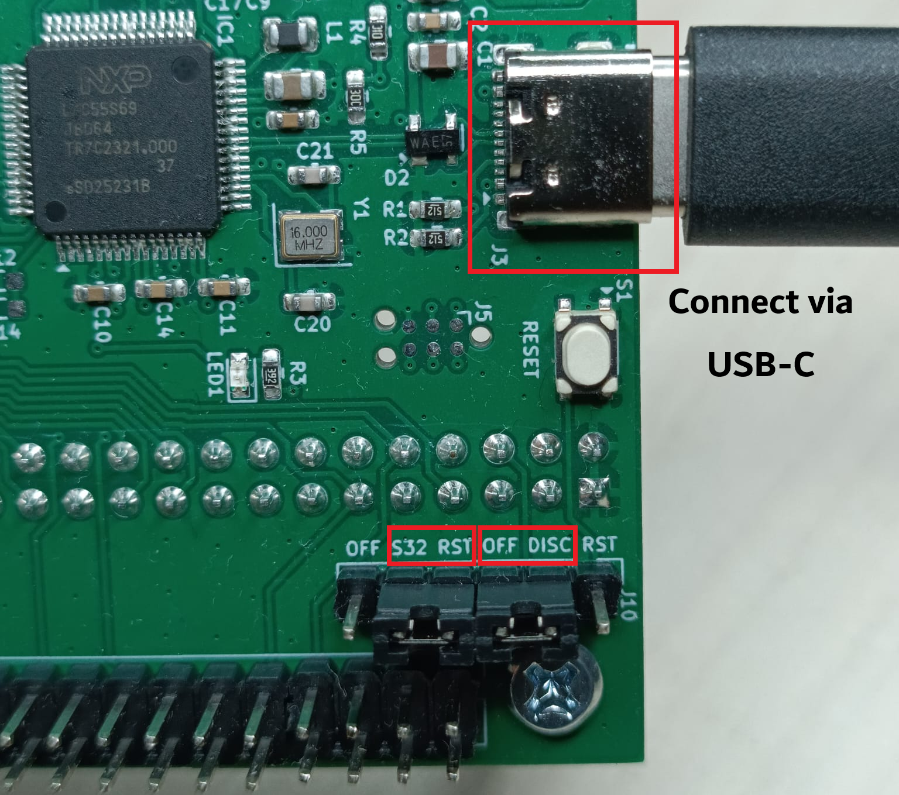
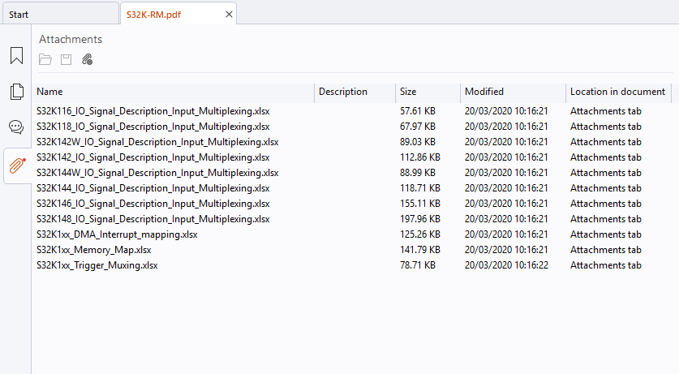

# Assignment 5: HAL development on S32K118

In this assignment the target platform changes from the STM32F407 to the NXP S32K118, an Arm Cortex‑M0+ microcontroller from the S32K1xx automotive family. On STM32, STM32CubeMX generated both the initialization code and a Hardware Abstraction Layer (HAL). On the S32K118, no vendor HAL is provided: you are given the CMSIS‑style register definitions and a minimal project skeleton, and the objective of this assignment is to implement the HAL yourself.

For every peripheral used in the exercises, a header file with a complete Doxygen description of the API (functions, parameters, preconditions, pin mapping) is supplied. Your task is to implement the corresponding `.c` files so that the provided example programs in `main.c` behave as specified.

---

## 0. Before you start — board preparation

> ⚠️ Before powering the board on and before flashing anything, the board jumpers must be reconfigured for the S32K118:
>
> - move the **STM** jumper to the **OFF** position (disables the STM32 side by keeping it all the time in reset);
> - move the **S32** jumper to the **RST** position (connects the reset signal on S32 to the reset button on the board).
> - connect the board via a USB-C
> Once this is done, the STM32 development board may remain physically attached to the shield — it does not interfere with the sensors/actuators.

The exact jumper locations are shown in the board schematic and in the KiCad project under [`ers-board-v1.2/`](ers-board-v1.2/). See in particular [`ers-board-v1.2/schematics.pdf`](ers-board-v1.2/schematics.pdf) and the KiCad sources under [`ers-board-v1.2/kicad/`](ers-board-v1.2/kicad/) [`210_prog_soft_start.kicad_sch`](ers-board-v1.2/kicad/210_prog_soft_start.kicad_sch) for the programmer/reset‑related jumpers, and the other sheets for the peripheral pin assignments referenced by the HAL headers.



---

## 1. Project contents

The project is self‑contained and is organized as follows (simplified):

```text
├── CMakeLists.txt              # top-level build script
├── devices/                    # CMSIS headers, startup code, linker script
│   ├── common/s32_core_cm0.h   
│   ├── S32K118/…               # register definitions, linker scripts, SVD
│   ├── device_registers.h
│   ├── callbacks.h
│   ├── devassert.h
│   ├── floats.h
│   ├── status.h
│   └── startup.c / .h
├── src/
│   ├── core/                   # provided: clock, systick, UART, syscalls
│   │   ├── clock.c / .h
│   │   ├── systick.c / .h
│   │   ├── syscalls.c / .h
│   │   ├── debug_uart.c / .h
│   │   └── system.c / .h       # system_init() convenience
│   ├── lib/                    # to be implemented: only the .h files are given
│   │   ├── led.h               # implement led.c
│   │   ├── btn.h               # implement btn.c
│   │   ├── btn_cnt.h           # implement btn_cnt.c
│   │   ├── kpad.h              # implement kpad.c
│   │   ├── enc.h               # implement enc.c
│   │   ├── servo.h             # implement servo.c
│   │   ├── spi.h               # implement spi.c
│   │   ├── lcd.h               # implement lcd.c
│   │   ├── lcd_font.c / .h     # provided (bitmap font)
│   │   ├── eeprom.h            # implement eeprom.c
│   │   ├── joy.h               # implement joy.c
│   │   └── sht40.h             # implement sht40.c
│   ├── e00_starter/main.c      # runs out-of-the-box, no HAL needed
│   ├── e01_led/main.c          # requires led.c
│   ├── e02_btn/main.c          # requires led.c, btn.c
│   ├── e03_btn_cnt/main.c      # requires led.c, btn.c, btn_cnt.c
│   ├── e04_kpad/main.c         # requires led.c, kpad.c
│   ├── e05_enc/main.c          # requires led.c, enc.c
│   ├── e06_servo/main.c        # requires led.c, enc.c, servo.c
│   ├── e07_lcd/main.c          # requires led.c, spi.c, lcd.c
│   ├── e08_eeprom/main.c       # requires led.c, spi.c, eeprom.c
│   ├── e09_joy/main.c          # requires led.c, joy.c
│   └── e10_sht/main.c          # requires several of the above and sht40.c
├── docs/                       # S32K118 reference manual and CPU documentation
└── unity/                      # Unity test framework (for the test targets)
```

Provided:

- [`devices/`](devices/) — NXP CMSIS register headers, startup code, and the GCC linker script.
- [`src/core/`](src/core/) — clock at 40 MHz, SysTick at 1 ms, debug UART (`printf` over LPUART1 at 1 Mbps), and syscalls. Calling `system_init()` performs all of this.
- [`src/lib/lcd_font.{c,h}`](src/lib/lcd_font.c) — 5×7 bitmap font used by the LCD driver.
- [`src/eXX_*/main.c`](src/) — the `main.c` of every exercise.
- [`CMakeLists.txt`](CMakeLists.txt) — all build targets, including flashing targets (`UP_*`).

To be implemented:

- One `.c` file per peripheral under [`src/lib/`](src/lib), implementing the API documented in the corresponding header. The header files contain the full specification (pin mapping, required behavior, preconditions, ISR contracts, and so on) and should be read carefully before starting.

No new `main.c` is to be written.

---

## 2. Toolchain

Two tools are required: an ARM GCC toolchain (for cross‑compilation) and OpenOCD (for flashing and debugging).

> A recent OpenOCD (version ≥ 0.12.0+dev – from 2026) is required. Older distribution packages frequently lack correct support for the S32K target. Prebuilt releases are available from <https://github.com/openocd-org/openocd/releases>.

In addition, CMake (≥ 3.20) and a build driver (Ninja is recommended; `make` is also supported) are required.

> The use of an IDE with integrated CMake support, such as CLion or Visual Studio Code (with the *CMake Tools* and *Cortex‑Debug* extensions), is strongly recommended. CLion ships its own bundled copies of CMake and Ninja, so under CLion only the ARM GCC toolchain and OpenOCD have to be installed separately. Both IDEs provide integrated support for GDB + OpenOCD debugging.

### 2.1 Windows

1. ARM GCC toolchain — install the standalone [Arm GNU Toolchain](https://developer.arm.com/downloads/-/arm-gnu-toolchain-downloads) (the `arm-none-eabi` package). Alternatively, it can be installed via the [Scoop](https://scoop.sh/) package manager: `scoop install gcc-arm-none-eabi`. Students who already have STM32CubeCLT installed from a previous assignment do not need to install anything else, since STM32CubeCLT ships `arm-none-eabi-gcc` and `arm-none-eabi-gdb` as part of its distribution.
2. OpenOCD — download the latest Windows build from the GitHub releases page listed above, extract the archive, and add its `bin/` directory to `PATH` (or invoke the executable with its full path).

### 2.2 Linux

Install the ARM GCC toolchain via your distribution's package manager (the package name varies between distributions; on Debian/Ubuntu it is `gcc-arm-none-eabi`).

---

## 3. Build system and workflow

The project uses CMake with the cross‑compilation toolchain configured directly inside `CMakeLists.txt` (which forces `arm-none-eabi-gcc` and links against the S32K118 linker script). The recommended way of working with the project is to open it as a CMake project in CLion or VS Code and let the IDE drive the configuration, build, and flashing steps.

### 3.1 Build targets

For each exercise target `eXX_name`, the build produces:

- `eXX_name.elf` — ELF file with debug symbols (consumed by GDB);
- `eXX_name.hex` — Intel HEX file (consumed by the flashing command);
- `eXX_name.map` — linker map;
- `eXX_name.asm` — full disassembly listing, useful for diagnosing subtle HAL issues.

### 3.2 Flashing the board

The development board is connected via CMSIS‑DAP over SWD. Each exercise defines an auto‑generated flashing target named `UP_<target>.elf` (for example, `UP_e00_starter.elf`). Building this target from the IDE builds the corresponding exercise, programs the flash, verifies the content, and resets the microcontroller. (The `UP_*` targets are custom CMake targets — they are *built*, not run. In CLion and VS Code, select the target from the target selector and invoke the usual *build* command.)

### 3.3 Serial output

`printf()` is routed to LPUART1 (pins PTC7/TX and PTC6/RX) at 1 Mbps, 8N1 by `debug_uart_init()`, which is invoked from `system_init()`.

A USB‑to‑UART adapter must be connected to these pins and a terminal application (for example PuTTY, Tera Term, `minicom`, `picocom`, or the VS Code *Serial Monitor* extension) configured for 1 000 000 baud, 8N1, no flow control.

### 3.4 Unit tests

Several modules (`e01_led`, `e02_btn`, `e03_btn_cnt`, `e08_eeprom`) are accompanied by a companion `test.c` that runs on the board. The tests are written against [Unity](https://www.throwtheswitch.org/unity), a small C unit‑testing framework designed for embedded targets. Each test file defines a set of `test_*` functions and registers them with `RUN_TEST(...)` inside `main`; Unity executes them sequentially, compares actual and expected values via `TEST_ASSERT_*` macros, and prints a `PASS`/`FAIL` line per test together with a summary of the whole run. The framework itself lives under `unity/` and is linked automatically into every test binary.

The corresponding binaries are exposed through the `TST_*` target prefix (for example, `UP_TST_e01_led.elf` builds and flashes the test variant of the LED exercise). Test results are printed on the debug UART. Some tests require an additional jumper wire; refer to the comments at the top of each `test.c` file for details.

### 3.5 Logging with `printf`

`printf` is the most immediate diagnostic instrument available and will be used throughout the assignment. The following points should be observed:

- Terminate each message with `\n` or call `fflush(stdout)` explicitly. The C runtime line‑buffers `stdout`, and a message without a newline may remain in the buffer and never be transmitted over the UART.
- Avoid calling `printf` from interrupt service routines. LPUART1 blocks when its transmit FIFO is full, so a verbose ISR may stall the main loop. For ISRs, either set a flag and perform the output from the main loop, or restrict the output to a single character via `debug_uart_putchar()`.
- Do not use the `%f` conversion specifier. Use integer formatting (milli‑units or fixed‑point) instead.

### 3.6 Reference documentation

Several reference PDFs are provided under `examples/s32/docs/`. You will not need to read any of them cover to cover; each one is a lookup reference for a specific layer of the stack.

- [`S32K-RM.pdf`](docs/S32K-RM.pdf) — **S32K1xx Series Reference Manual.** The primary document for this assignment. Contains the description of every peripheral (GPIO/PORT, LPSPI, LPI2C, LPUART, LPIT, ADC, FTM, DMA/DMAMUX, FlexCAN, …) and the corresponding register maps, together with the **pin‑mux (PORT alternate‑function) tables** and the **DMAMUX source tables** (which DMA request number corresponds to which peripheral). The register names used in the manual match the macros in `devices/S32K118/include/S32K118.h`, so a chapter in this PDF translates directly to the register writes you need in your `.c` file. Consult it whenever you are configuring a new peripheral, wiring a pin to an alternate function, or hooking a peripheral to a DMA channel. **Note**: the reference manuals has a number of attachments, including S32K118 IO signal description input multiplexing and S32K1xx DMA interrupt mapping as excel files. To see the attachments, open the PDF in a capable viewer (for example, Foxit PDF Reader or Acrobat Reader) and look for the attachments pane.




- [`S32K1xx.pdf`](docs/S32K1xx.pdf) — **S32K1xx Data Sheet.** Electrical characteristics, memory map overview, clock tree, and package pin assignments. Useful for the electrical/timing side of things; the functional pin‑mux information is in `S32K-RM.pdf` (see above).
- `Arm_Architecture_v6m_Reference_Manual.pdf` — **ARMv6‑M Architecture Reference Manual.** Defines the instruction set, exception model, and programmer's model of the Cortex‑M0+ core. Needed only if you want to read or understand Thumb assembly (for example, the `.asm` listing produced by the build) or when dealing with low‑level exception behavior.
- [`DDI0484C_cortex_m0p_r0p1_trm.pdf`](docs/DDI0484C_cortex_m0p_r0p1_trm.pdf) — **Cortex‑M0+ Technical Reference Manual.** Implementation‑specific documentation of the CPU core (NVIC layout, SysTick, pipeline behavior). Relevant mainly when you are configuring the NVIC (interrupt enable/priority) or SysTick — both of which are already done for you in `core/`, but are worth consulting if you add your own interrupts.
- [`DUI0662B_cortex_m0p_r0p1_dgug.pdf`](docs/DUI0662B_cortex_m0p_r0p1_dgug.pdf) — **Cortex‑M0+ Devices Generic User Guide.** A tutorial‑style companion to the TRM, written from a programmer's point of view. Often a gentler starting point when the TRM is too dense.

In short: start from the corresponding header in `src/lib/`, look up the peripheral chapter (and the pin‑mux and DMAMUX tables) in `S32K-RM.pdf` and fall back to the Cortex‑M0+ documents only for core‑side questions (interrupts, exceptions, low‑level CPU behavior).

---

## 4. How to work on an exercise

Each HAL module should be implemented one at a time and verified with the corresponding exercise program. The recommended procedure for every exercise is:

1. Open the corresponding `.h` file in `src/lib/` and read the Doxygen description in full (pin mapping, expected behavior, whether functions may be called from ISR context, notes on listeners, and so on).
2. Consult the relevant peripheral chapter in the S32K118 Reference Manual (`docs/S32K-RM.pdf`). The register names in the manual match the macros in `devices/S32K118/include/S32K118.h`.
3. Create the `.c` file in `src/lib/`. No modification to `CMakeLists.txt` is required — the top‑level `CMakeLists.txt` already references the expected filenames.
4. Build the `UP_eXX_...elf` target to flash the corresponding exercise, and verify the behavior on the board and over UART.
5. If a unit test is provided for the module (see [§ 3.4](#34-unit-tests)), flash it by building the matching `UP_TST_eXX_...elf` target and confirm that all test cases pass on the debug UART. Executing the provided tests is a mandatory part of the assignment: a module counts as correctly implemented only once its test reports all `PASS`. Any additional wiring required by the test is documented at the top of the corresponding `test.c` file.

### 4.1 Using AI assistants

You are allowed to use AI coding assistants (Copilot, ChatGPT, Claude, Gemini, …) while working on this assignment, but the following conditions apply:

- **Review every register assignment manually.** AI models are trained on a huge variety of microcontroller families, and they routinely produce code that *looks* correct but encodes subtle mistakes. Always cross‑check the generated register configuration against the corresponding chapter of `docs/S32K-RM.pdf` before trusting it, especially for PORT `PCR` (MUX field), PCC clock gates, peripheral enable bits, DMAMUX source numbers, and NVIC settings.
- **You must be able to explain every register assignment in your code.** During evaluation you may be asked to walk through any line of any peripheral configuration. You will be given the relevant register map from the Reference Manual, so you do not have to memorise the register abbreviations and bit positions — but you are expected to explain, for every `PCC->PCCn[...] = …`, every `PORT->PCR[...] = …`, every `LPSPIx->CFGRx = …`, and so on, *why* those bits are set the way they are and what the resulting hardware behavior is. "The AI wrote it" is not an acceptable answer. If you cannot explain a line, treat that as a signal to go back and read the relevant section of the Reference Manual until you can.

---

## 5. Exercises

### Exercise 0 — Starter and environment verification

Target: `e00_starter`.

Goal: verify that the complete toolchain (build, flash, serial terminal, debugger) is functional before any HAL code is written. No HAL code is required for this exercise; only the provided `core` modules are used.

Expected behavior: once flashed, the board prints one line per second on the debug UART:

```text
[0000000003] Counter 0
[0000001003] Counter 1
[0000002003] Counter 2
…
```

If the output is garbled, verify that the terminal is configured for 1 Mbps. If there is no output at all, verify that the USB‑to‑UART adapter is wired to PTC7 and PTC6 and that no other device is driving these pins.

---

### Exercise 1 — LED

Target: `e01_led`. Module: `led.c`.

Goal: implement GPIO output control for the four on‑board LEDs. Verified by `e01_led` cycling through the LEDs one at a time.

Build the `UP_TST_e01_led.elf` target to flash and execute the unit test, and confirm that all cases report `PASS` on the debug UART.

---

### Exercise 2 — Buttons

Target: `e02_btn`. Module: `btn.c`.

Goal: implement GPIO input and PORT‑interrupt handling for the four on‑board buttons. Verified by `e02_btn` printing the button state on every edge.

Build the `UP_TST_e02_btn.elf` target to flash and execute the unit test, and confirm that all cases report `PASS` on the debug UART.

---

### Exercise 3 — Button counter with debouncing

Target: `e03_btn_cnt`. Module: `btn_cnt.c`.

Goal: implement a debounced press counter on top of `btn.c` and the SysTick listener mechanism, following the state machine described in `btn_cnt.h`. Verified by `e03_btn_cnt` reporting a stable count even under rapid repeated presses.

Build the `UP_TST_e03_btn_cnt.elf` target to flash and execute the unit test, and confirm that all cases report `PASS` on the debug UART.

---

### Exercise 4 — Matrix keypad

Target: `e04_kpad`. Module: `kpad.c`.

Goal: implement scanning of the external 3×4 matrix keypad. Verified by `e04_kpad` printing the set of pressed keys whenever it changes.

---

### Exercise 5 — Rotary encoder

Target: `e05_enc`. Module: `enc.c`.

Goal: implement quadrature decoding of the rotary encoder using FTM1, plus GPIO input for the encoder push button. Verified by `e05_enc` printing the encoder position and resetting it on button press.

---

### Exercise 6 — Servo motor

Target: `e06_servo`. Module: `servo.c`.

Goal: implement 50 Hz PWM control of the SG90 servo using FTM0. Verified by `e06_servo` driving the servo from the encoder position.

---

### Exercise 7 — SPI and ST7565 LCD

Modules: `spi.c`, `lcd.c`.

Goal: implement the SPI driver for LPSPI0 and the ST7565 graphical LCD driver on top of it.

This exercise is split into two phases and should be done in order:

1. **Blocking variant — target `e07_lcd`.** Start with the blocking SPI (`spi_txrx`) and the full framebuffer‑based drawing API. The implementation busy‑waits on the LPSPI `TDF`/`RDF` flags. Verified by `e07_lcd` showing a static text pattern and animated pixels.
2. **DMA variant — target `e07_lcd-dma` (OPTIONAL, for the daring ones).** Once the blocking variant works, add the DMA path (`spi_dma_txrx` plus the asynchronous path in `lcd.c`), compiled with the `SPI_WITH_DMA` definition that the `e07_lcd-dma` target already provides. The on‑screen behavior must be identical; the difference is that the main loop stays responsive during SPI transfers. **This phase is optional** — it is significantly more involved than the blocking variant, and students may skip it and move on to exercise 8.

Read `spi.h` carefully before starting the DMA phase — especially the instructions on the buffer alignment and byte‑swap.

#### How to build the DMA path

The DMA variant offloads the entire transfer to eDMA + LPSPI, so `spi_dma_txrx()` can return immediately and the caller is notified later via a callback. Before starting, read `spi.h` in full — it fixes the observable contract (non‑blocking semantics, 4‑byte buffer alignment, byte swap, split TX/RX callbacks). The implementation can then proceed roughly as follows:

1. **Two DMA channels.** Allocate one channel for TX (source = memory buffer, destination = `LPSPI0->TDR`) and one for RX (source = `LPSPI0->RDR`, destination = memory buffer). Route the LPSPI0 TX and RX requests to them via DMAMUX (sources 15 and 14) and enable LPSPI's DMA request generation with `DER = TDDE | RDDE`.

2. **4‑byte transfer granularity.** Program the eDMA TCDs with `SSIZE = DSIZE = 2` (meaning 2² = 4 bytes) and `NBYTES = 4`. The major‑loop iteration count is `count / 4`. This is why `spi.h` requires buffers aligned to 4 bytes.

3. **Byte swap.** The Cortex‑M0+ is little‑endian, but LPSPI shifts out `TDR` MSB‑first. Setting `LPSPI_TCR_BYSW = 1` reverses the byte order inside each 32‑bit transfer, so the bytes appear on the wire in the same order as they sit in memory.

4. **Frame size.** `LPSPI_TCR_FRAMESZ = count * 8 − 1` controls exactly how many bits are clocked. A byte count that is not a multiple of 4 therefore stops in the middle of the last word; the tail (`count & 3` bytes) is handled differently on TX and RX:

   - **TX tail — scatter‑gather.** Prepare a second TCD (statically allocated, 32‑byte aligned) that transfers a single 32‑bit word from a small staging variable into `TDR`. Before starting the transfer, copy the `rem = count & 3` tail bytes into that staging word *right‑aligned*, so that after the byte swap they clock out in the correct order. Link the two TCDs by setting the main TCD's `DLASTSGA` to the address of the tail TCD and `CSR.ESG = 1`; when the main major loop finishes, eDMA automatically switches to the tail TCD. When `count` is a multiple of 4, scatter‑gather is disabled and `CSR.DREQ = 1` stops the channel cleanly after the major loop.

   - **RX tail — LPSPI Frame‑Complete IRQ.** The RX DMA channel only receives a request once a full 32‑bit word is in the RX FIFO, and so it will never service the tail. Enable the LPSPI frame‑complete interrupt (`IER.FCIE = 1`) and, inside the ISR, read `LPSPI0->RDR` once and un‑swap the remaining bytes into the caller's RX buffer.

5. **Completion callbacks.** Two callbacks are delivered independently, matching the `spi.h` contract:
   - The TX callback is fired from the LPSPI frame‑complete ISR.
   - The RX callback is fired from the DMA major‑loop interrupt on the RX channel (enable it with `CSR.INTMAJOR = 1`) when `count % 4 == 0`; otherwise it is fired from the LPSPI frame‑complete ISR after the tail has been drained.

6. **Idle tracking.** Keep two independent idle flags (TX, RX); each becomes false when its side is queued and true again only once its callback has been invoked. `spi_is_idle()` returns the conjunction; `spi_dma_txrx()` refuses a new request if either side is still busy.

The LCD driver on top of this must become asynchronous as well: `lcd_update()` starts a DMA transfer and returns immediately, and the DC and CS lines must be toggled inside the callbacks (not inline after `spi_dma_txrx()`), since at that point no bit has yet left the shift register. The header shows the callback‑chaining pattern to use.

---

### Exercise 8 — SPI EEPROM (M95080)

Target: `e08_eeprom`. Module: `eeprom.c`.

Goal: implement page‑level read and write access to the M95080 SPI EEPROM, including WIP polling. Verified by `e08_eeprom` writing a test pattern to page 0, reading it back, and turning the green LED on if the contents match (red otherwise).

Build the `UP_TST_e08_eeprom.elf` target to flash and execute the unit test, and confirm that all cases report `PASS` on the debug UART.

---

### Exercise 9 — Analog joystick

Target: `e09_joy`. Module: `joy.c`.

Goal: implement 12‑bit ADC conversions of the joystick X/Y channels on ADC0, plus the push‑button GPIO. Verified by `e09_joy` streaming the joystick state over UART.

---

### Exercise 10 — SHT40 temperature and humidity sensor

Target: `e10_sht`. Module: `sht40.c`.

Goal: implement the SHT40 driver over LPI2C0 with periodic, asynchronous measurements triggered by LPIT channel 0. Verified by `e10_sht`, which integrates the sensor with the LCD and EEPROM from the earlier exercises: the current and min/max temperature/humidity are displayed on the LCD and persisted across reset.

## Cookbook
Please refer to the [cookbook](docs/AN5413.pdf) for examples of how to use registers to configure and how to use peripherals.

The book references a repo with example code, which has moved to the following location:
https://github.com/nxp-auto-support/s32k118_cookbook

---

## Submission

Submit your solution in the `assignment5/` folder of your course GitLab repository. For each implemented module, include the `.c` file (and any other files that have been modified). The `build-debug/` and `build-release/` directories should not be committed.
